Co-located virtual Mayor / 9-11 call-center automated dispatch containerized ISO w/ solar and fiber connect/cognitive microwave packet broadcast/ tropospheric scatter.

To design a co-located virtual Mayor and 9-11 call-center automated dispatch system using a containerized ISO, let's break down the components and design elements:

### Components and Features:
1. **Containerized ISO Structure**:
   - **Dimensions**: Standard ISO shipping container (20ft or 40ft).
   - **Cooling System**: Water-cooled system to maintain optimal temperature.
   - **Power Supply**:
     - Primary: Solar panels with battery storage.
     - Backup: Diesel generator.
   - **Connectivity**:
     - Fiber optic connection for high-speed internet.
     - Cognitive microwave packet broadcast.
     - Tropospheric scatter communication for redundancy.

2. **Software Stack**:
   - **Operating System**: Ubuntu 22.04 LTS.
   - **Virtualization and Orchestration**:
     - Docker for containerization.
     - Kubernetes for orchestration.
   - **Communication Tools**:
     - VoIP for voice communications.
     - Real-time data processing and dispatch software.
   - **AI and NLP**:
     - Large Language Models (LLMs) for virtual mayor and automated dispatch.
     - NLP tools for natural language understanding.
   - **Security**:
     - Firewall and intrusion detection/prevention systems.
     - Encrypted communication channels.

3. **Hardware Specifications**:
   - High-performance servers with multi-core processors.
   - High-capacity SSD storage.
   - Sufficient RAM for handling real-time data and AI processing.

4. **Networking**:
   - Redundant networking with load balancing.
   - Failover mechanisms for uninterrupted service.
   - Secure VPN for remote access and management.

5. **Emergency Response Integration**:
   - Automated dispatch system for 9-11 calls.
   - Real-time tracking and communication with emergency services.
   - Incident management and reporting tools.

6. **User Interface**:
   - Web-based dashboard for monitoring and control.
   - Mobile application for field responders.
   - Voice interface for the virtual mayor.

7. **Backup and Recovery**:
   - Automated data backup system.
   - Disaster recovery plan with regular testing.

### System Diagram

```mermaid
graph TD;
    A[Co-located Virtual Mayor / 9-11 Call-Center Container] -->|Solar Power| B(Solar Panels & Battery Storage)
    A -->|Backup Power| C(Diesel Generator)
    A -->|Primary Connectivity| D(Fiber Optic Connection)
    A -->|Redundant Connectivity| E(Cognitive Microwave Packet Broadcast)
    A -->|Emergency Connectivity| F(Tropospheric Scatter Communication)
    
    A -->|Cooling| G(Water-Cooled System)
    A -->|Software| H[Open Source Software Stack]
    
    H --> I[Ubuntu 22.04 LTS]
    H --> J[Docker & Kubernetes]
    H --> K[VoIP & Real-Time Dispatch]
    H --> L[LLMs & NLP Tools]
    H --> M[Security Systems]
    
    A -->|Hardware| N[High-Performance Servers]
    A --> O[High-Capacity SSD Storage]
    A --> P[Sufficient RAM]
    
    A -->|Networking| Q[Redundant Networking]
    Q --> R[Load Balancing]
    Q --> S[Failover Mechanisms]
    Q --> T[Secure VPN]
    
    A -->|Emergency Response Integration| U[Automated Dispatch System]
    U --> V[Real-Time Tracking]
    U --> W[Incident Management Tools]
    
    A -->|User Interface| X[Web-Based Dashboard]
    X --> Y[Mobile Application]
    X --> Z[Voice Interface]

    A -->|Backup and Recovery| AA[Automated Data Backup]
    AA --> AB[Disaster Recovery Plan]
```

This diagram outlines the key components and their interactions within the system, ensuring a robust, reliable, and efficient virtual mayor and 9-11 call-center automated dispatch solution.
