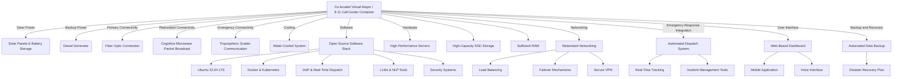

Co-located virtual Mayor / 9-11 call-center automated dispatch containerized ISO w/ solar and fiber connect/cognitive microwave packet broadcast/ tropospheric scatter.

```mermaid
graph TD;
    A[Co-located Virtual Mayor / 9-11 Call-Center Container] -->|Solar Power| B(Solar Panels & Battery Storage)
    A -->|Backup Power| C(Diesel Generator)
    A -->|Primary Connectivity| D(Fiber Optic Connection)
    A -->|Redundant Connectivity| E(Cognitive Microwave Packet Broadcast)
    A -->|Emergency Connectivity| F(Tropospheric Scatter Communication)
    
    A -->|Cooling| G(Water-Cooled System)
    A -->|Software| H[Open Source Software Stack]
    
    H --> I[Ubuntu 22.04 LTS]
    H --> J[Docker & Kubernetes]
    H --> K[VoIP & Real-Time Dispatch]
    H --> L[LLMs & NLP Tools]
    H --> M[Security Systems]
    
    A -->|Hardware| N[High-Performance Servers]
    A --> O[High-Capacity SSD Storage]
    A --> P[Sufficient RAM]
    
    A -->|Networking| Q[Redundant Networking]
    Q --> R[Load Balancing]
    Q --> S[Failover Mechanisms]
    Q --> T[Secure VPN]
    
    A -->|Emergency Response Integration| U[Automated Dispatch System]
    U --> V[Real-Time Tracking]
    U --> W[Incident Management Tools]
    
    A -->|User Interface| X[Web-Based Dashboard]
    X --> Y[Mobile Application]
    X --> Z[Voice Interface]

    A -->|Backup and Recovery| AA[Automated Data Backup]
    AA --> AB[Disaster Recovery Plan]
```
